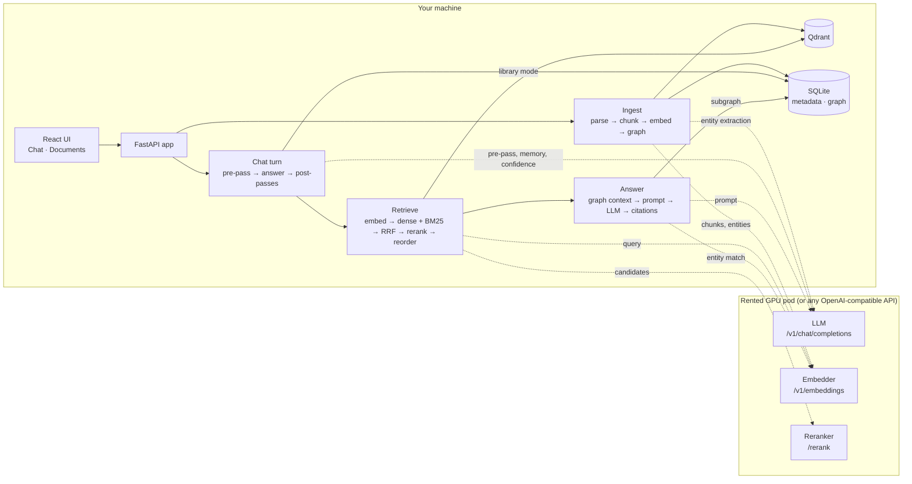
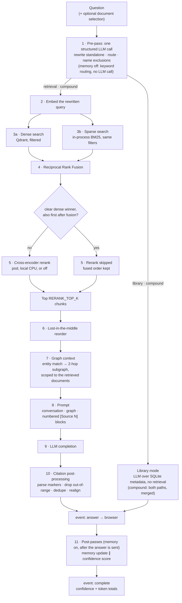

# ragline

**A proof-of-concept test bench for retrieval-augmented generation on rented GPUs.**
ragline runs a complete document-QA pipeline on your own machine — ingestion,
hybrid retrieval, reranking, a knowledge graph, cited answers, a chat UI — and
sends every model call to OpenAI-compatible endpoints you point it at. Rent a
GPU pod, serve an LLM, an embedder and a reranker on it, change a few lines of
`.env`, and measure how that stack answers a fixed set of questions about a
fixed set of documents.

> **Status: experimental.** ragline is a single-user tool that runs on a local
> machine and binds to `127.0.0.1`. Authentication and deployment
> infrastructure are not finished: there is an unvalidated multi-user design in
> the tree ([deploy/intranet/](deploy/intranet/RUNBOOK.md)), and no hardening
> for exposure to a network. Read [SECURITY.md](SECURITY.md) before running it
> anywhere other people can reach.

## What it is for

Answering questions like *"is a 27B model at 4-bit good enough to read
datasheet tables?"* or *"what does this stack cost me in latency on a cheaper
card?"* with numbers rather than impressions:

- **One pipeline, swappable models.** The LLM, the embedder and the reranker
  are each a base URL, a key and a model name. Nothing else changes when the
  hardware or the weights do.
- **A golden question set with evidence.** 60 questions over 119 HMI
  datasheets and manuals, each with the expected answer, the document and page
  it comes from, and the quoted line — including comparisons, follow-ups and
  questions that deliberately have no answer in the corpus.
- **Recorded runs.** `scripts/evaluate.py` writes a results file per run with
  the stack it ran against, per-question answers, citations, latency, token
  counts and per-stage timings, so two stacks can be compared after the fact.
- **A UI for the part numbers don't cover.** Upload documents, chat, click a
  citation and land on the cited page.

The companion project **[podlink](https://github.com/14MM47/podlink)** brings
the GPU pod up and down and hands ragline its endpoints. ragline does not
depend on it — any OpenAI-compatible endpoint works, including a cloud API.

## How it works

Two views: the moving parts, then what happens to one question, in order.



One question runs through these steps in this order. Nothing is parallel
except the two search legs and the two post-passes; every later stage consumes
the output of the one before it.



- **Ingestion** — single / multi-file / ZIP upload or a server-side folder;
  PDF (pymupdf4llm, layout analysis, optional Tesseract OCR), DOCX, XLSX;
  512-token page-exact chunks; SHA-256 dedup; document versioning.
- **Retrieval** — dense (Qdrant) + sparse (BM25) fused with Reciprocal Rank
  Fusion, then a cross-encoder rerank (on the pod, or a local CPU model, or
  off) that is skipped when the dense scores already show a clear winner that
  fusion also ranked first; then lost-in-the-middle reordering. Optional
  restriction to selected documents applies to both search legs.
- **Knowledge graph** — the LLM extracts entities and relationships at ingest;
  at answer time, after retrieval, a subgraph scoped to the retrieved documents
  joins the prompt.
- **Hard citations** — the LLM only emits `[Source N]` markers. File, page,
  section and quote are carried programmatically from the retrieved chunks;
  out-of-range markers are dropped and every citation links to the page. There
  is no separate verification pass: the post-processing is the check.
- **Chat** — a structured pre-pass (rewrite + route), the answer, and then,
  after the answer has been sent, a memory post-pass and a confidence score. A
  per-turn memory toggle shows what the conversation context costs in tokens.
- **Library mode** — questions about the collection itself ("which Siemens
  manuals do you have?") are answered from the metadata database.

More in [docs/architecture.md](docs/architecture.md).

## Quickstart (local, single user)

Needs Python 3.11+, [uv](https://docs.astral.sh/uv/), Docker and Node 20+.

```bash
git clone https://github.com/14MM47/ragline.git && cd ragline

docker compose up -d qdrant                 # vector store on 127.0.0.1:6333
uv sync --extra dev --extra ocr             # backend (+ tests, + OCR wrapper)
(cd frontend && npm ci && npm run build)    # the UI the API serves at /

cp env.template .env                        # boots as copied: auth off, one local user
$EDITOR .env                                # set the model endpoints (below)

.venv/bin/python scripts/smoke_llm.py       # one completion + one embedding through your endpoints
./restart.sh                                # http://127.0.0.1:8000
```

The only settings you must fill in are the model endpoints. Any
OpenAI-compatible API will do for a first run:

```dotenv
LLM_BASE_URL=https://api.openai.com/v1
LLM_API_KEY=sk-...
LLM_MODEL=gpt-4o
EMBEDDING_MODEL=text-embedding-3-large
RERANKER_PROVIDER=local        # CPU cross-encoder, ~2 GB download on first start; "none" skips it
```

`env.template` documents every setting; [docs/configuration.md](docs/configuration.md)
covers the ones that matter and the one trap (changing embedder means a new
collection, SQLite database and storage directory, followed by a re-ingest).

## Running against a rented GPU pod

ragline needs three services from the pod: an OpenAI-compatible LLM, an
OpenAI-compatible embedder, and a rerank endpoint (TEI `/rerank` or
Cohere-style `/v1/rerank`).

```dotenv
LLM_BASE_URL=https://<pod-id>-8000.proxy.runpod.net/v1
LLM_API_KEY=<pod bearer>
LLM_MODEL=<served model name>

EMBEDDING_BASE_URL=https://<pod-id>-8080.proxy.runpod.net/v1
EMBEDDING_API_KEY=<pod bearer>
EMBEDDING_MODEL=Qwen/Qwen3-Embedding-8B
EMBEDDING_DIMENSIONS=4096

RERANKER_PROVIDER=api
RERANKER_BASE_URL=https://<pod-id>-8081.proxy.runpod.net
RERANKER_API_KEY=<pod bearer>
RERANKER_API_FORMAT=cohere     # or "tei"
```

With [podlink](https://github.com/14MM47/podlink) this block is written for
you: its client-env hook runs `scripts/apply_pod_env.py`, which merges the
live endpoints into `.env` and restarts ragline each time a pod comes up.
[docs/gpu-pod.md](docs/gpu-pod.md) has the full walkthrough, the stacks that
have been run, and how to serve the three models yourself.

## Evaluation

```bash
.venv/bin/python scripts/fetch_corpus.py --category hmi      # ~0.7 GB of public datasheets
.venv/bin/python scripts/ingest.py testdata/hmi              # parse, embed, build the graph
.venv/bin/python scripts/evaluate.py eval/golden_set_hmi.json \
    -o eval/results/$(date +%F)_my-stack.json --label my-stack
```

### The corpus is indexed, not included

The test corpus is 803 vendor datasheets and manuals for industrial automation
equipment (HMIs, PLCs, drives, sensors, …). They are free to download but they
are the vendors' copyright, so the PDFs are **not in this repository**.
Instead, [eval/corpus/](eval/corpus/README.md) lists every one — path, title,
page count, SHA-256, and the public URL it came from — and
`scripts/fetch_corpus.py` rebuilds the directory tree from that list. The
golden set names documents by those paths, so
[eval/corpus/INDEX.md](eval/corpus/INDEX.md) shows which questions draw on
which document.

About a fifth of the documents have no recorded URL (they were collected by
hand before the fetch log existed), including 22 of the 68 that the golden set
cites. They are listed with their title and digest so they can be found and
verified; until they are in place, the questions that rely on them will miss.

### Recorded runs

One stack so far, on two cards: `RedHatAI/Qwen3.8-27B-INT4` (thinking off) for
every LLM call, `Qwen/Qwen3-Embedding-8B` (4096-dim) and `Qwen3-Reranker-0.6B`,
all three on a single GPU. 60 questions; the source hit-rate is scored on the
51 that name an expected source.

| Run | GPU | Source hit-rate | Answers with a citation | Median latency | Whole set |
|---|---|---|---|---|---|
| 2026-09-28 | 1× RTX PRO 6000 (96 GB) | 45 / 51 (0.88) | 60 / 60 | 6.5 s | 7.6 min |
| 2026-09-29 | 1× RTX A6000 (48 GB) | 44 / 51 (0.86) | 60 / 60 | 11.6 s | 14.0 min |
| 2026-10-02 · answer-length rule | 1× RTX A6000 | 43 / 51 (0.84) | 56 / 60 | 11.9 s | 12.6 min |
| 2026-10-02 · per-stage timing | 1× RTX A6000 | 42 / 51 (0.82) | 58 / 60 | 10.7 s | 12.0 min |

Where the time goes on the A6000 (median per question): answer generation
5.4 s, knowledge-graph context 2.6 s, rerank 1.4 s, query embedding 0.7 s,
vector + sparse search under 0.1 s.

**The source hit-rate overstates answer quality.** Graded by hand, the first
run got 37 of 46 answerable questions right (80%), abstained or answered
partially on 5, and was *confidently wrong* on 3 — every one a wrong row or
column read out of a flattened specification table in the correct document.
All 6 unanswerable questions were declined. Run-to-run movement of one or two
questions in the automatic score is noise. Details:
[eval/results/](eval/results/README.md) and [docs/evaluation.md](docs/evaluation.md).

## Known limitations

- **Tables.** Specification tables are flattened to text at parse time, and
  that is where the wrong answers come from.
- **Comparisons.** A two-product question is embedded as one query and often
  retrieves only one product's document.
- **The evaluator scores sources, not answers.** Correctness is graded by
  hand; follow-up questions are run without their previous turn; the three
  library-mode questions cannot be answered by chunk retrieval at all.
- **The golden set is not fully reviewed.** 8 of 60 expected answers have been
  checked against the PDF by a person
  ([review sheet](eval/golden_set_hmi_review.md)); three are flagged as doubtful.
- **Scale.** BM25 is rebuilt in memory, metadata lives in SQLite, and the
  knowledge-graph index is rebuilt per query. Fine for hundreds of documents;
  not designed for more yet.
- **Security.** No upload size limit, no rate limiting, and with auth off —
  the only tested configuration — no login at all. See [SECURITY.md](SECURITY.md).

## Tests

```bash
.venv/bin/python -m pytest tests/unit -q          # fast, no services needed
.venv/bin/ruff check .
(cd frontend && npm test && npx tsc --noEmit)     # Vitest + typecheck

RAGLINE_INTEGRATION=1 \
.venv/bin/python -m pytest tests/integration -q   # needs Qdrant + configured endpoints
```

## Repository layout

| Path | What is there |
|---|---|
| `src/ragline/` | The backend. Every module opens with a docstring explaining its role and is commented throughout. |
| `frontend/` | React + Vite + TypeScript UI (Chat and Documents tabs). |
| `scripts/` | Command-line tools: ingest, evaluate, corpus fetch/index, endpoint smoke test, pod env hook. |
| `eval/` | The golden question set, its review sheet, the corpus index and the recorded runs. |
| `docs/` | Architecture, configuration, GPU pod guide, evaluation method, Hugging Face notes. |
| `deploy/intranet/` | Experimental multi-user deployment (Entra SSO, NTFS ACL gating, nginx, systemd). Not validated. |
| `tests/` | Unit tests (no services) and one integration round-trip. |

## Lineage

ragline is a trimmed, fully commented port of
[raggles](https://github.com/14MM47/raggles), a playground for comparing RAG
techniques side by side. ragline keeps one retrieval path and about thirty
settings, and adds the pod workflow, the evaluation harness and document
provenance (citations can carry a file's original network location).

## Licence

ragline's own code is [MIT](LICENSE)-licensed. Its PDF parser is not: ragline
depends on PyMuPDF, pymupdf4llm and pymupdf-layout, all **AGPL-3.0** (or
commercial from Artifex) at the pinned version. Running ragline yourself is
unaffected; **distributing it together with them, or offering it to others as
a network service, brings the AGPL's source-availability terms into play.**
See [THIRD_PARTY.md](THIRD_PARTY.md) for the details — including why the
parser pin must not be lowered — and for the licences of the model weights
the documentation refers to.
